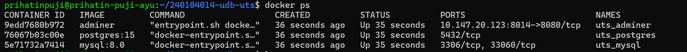
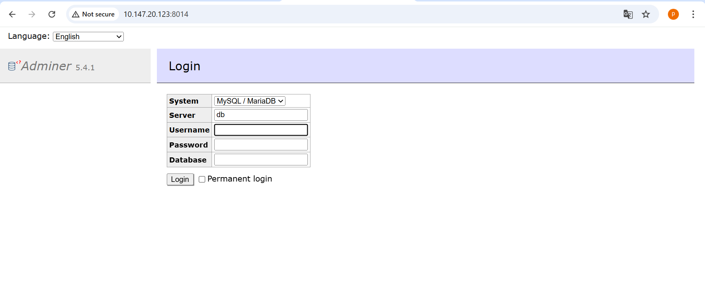
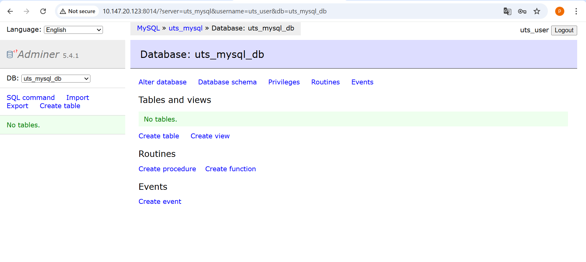
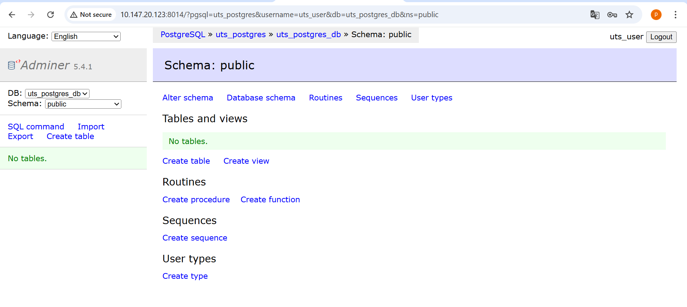

# UTS Praktikum Manajemen Jaringan

## Identitas Mahasiswa
- Nama: Prihatin Puji Ayu
- NIM: 240104014

## Konfigurasi
- IP ZeroTier Host: 10.147.20.123
- Port Adminer: 8014

## Cara Menjalankan Project
```bash
docker compose up -d

## Screenshot

### Docker PS
[](images/docker-ps.png)

### Adminer diakses via ZeroTier
[](images/Adminer-zerotier.png)

### Login Adminer ke MySQL
[](images/adminer-mysql.png)

### Login Adminer ke PostgreSQL
[](images/adminer-postgres.png)


